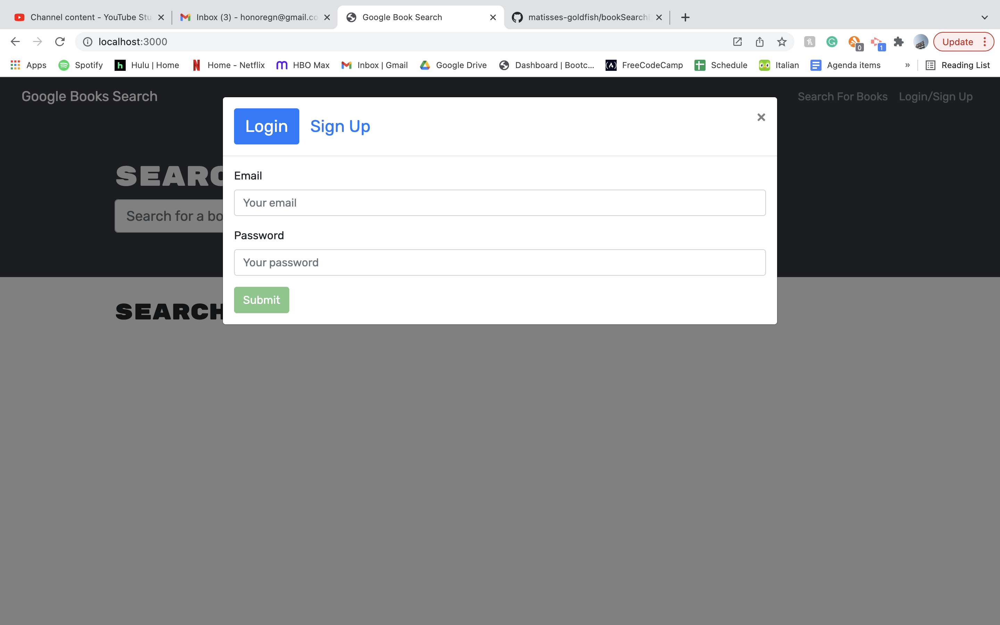
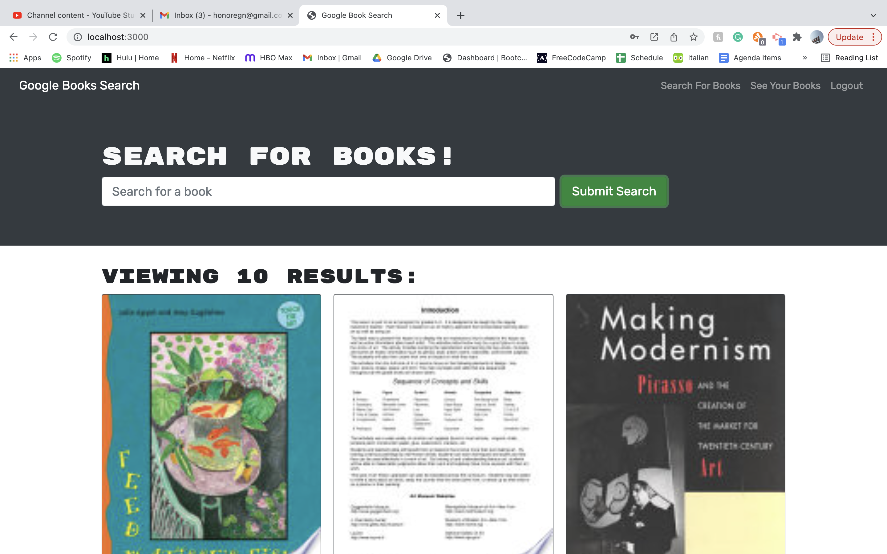

# Book Search Engine
[](https://opensource.org/licenses/)
#### **Name:** Honore Nelson 
#### **Deployed Link:** https://booksearchengine02.herokuapp.com/
#### **Github Repo:** https://github.com/matisses-goldfish/bookSearchEngine
---
    
##  Table of Contents:
* [Description](#description)
* [Walkthrough](#walkthrough)
* [Application](#application)
* [Completed Criteria](#completed-criteria)
* [Future Development](#future-development)
* [Technologies Used](#technologies-used)
* [Usage Information](#usage)
* [Contribution Guidelines](#contribution-guidelines)
* [Authors](#authors)
* [License](#license)
* [Question](#questions)


## Description:
---
This application is a fully functioning Google Books API search engine built convertered from a RESTful API to be a GraphQL API built with Apollo Server. The app was built using the MERN stack with a React front end, MongoDB database, and Node.js/Express.js server and API. It's already set up to allow users to save book searches to the back end. 


## Walkthrough: 
---
### Click the img to begin the video- 
[](https://www.youtube.com/watch?v=IxaUg_VmiLQ)


## Application:
---
### Login Page-


### Search for Books-


### Saved Books-


    
## Completed Criteria:
---

```md
GIVEN a book search engine
WHEN I load the search engine
THEN I am presented with a menu with the options Search for Books and Login/Signup and an input field to search for books and a submit button
WHEN I click on the Search for Books menu option
THEN I am presented with an input field to search for books and a submit button
WHEN I am not logged in and enter a search term in the input field and click the submit button
THEN I am presented with several search results, each featuring a book’s title, author, description, image, and a link to that book on the Google Books site
WHEN I click on the Login/Signup menu option
THEN a modal appears on the screen with a toggle between the option to log in or sign up
WHEN the toggle is set to Signup
THEN I am presented with three inputs for a username, an email address, and a password, and a signup button
WHEN the toggle is set to Login
THEN I am presented with two inputs for an email address and a password and login button
WHEN I enter a valid email address and create a password and click on the signup button
THEN my user account is created and I am logged in to the site
WHEN I enter my account’s email address and password and click on the login button
THEN I the modal closes and I am logged in to the site
WHEN I am logged in to the site
THEN the menu options change to Search for Books, an option to see my saved books, and Logout
WHEN I am logged in and enter a search term in the input field and click the submit button
THEN I am presented with several search results, each featuring a book’s title, author, description, image, and a link to that book on the Google Books site and a button to save a book to my account
WHEN I click on the Save button on a book
THEN that book’s information is saved to my account
WHEN I click on the option to see my saved books
THEN I am presented with all of the books I have saved to my account, each featuring the book’s title, author, description, image, and a link to that book on the Google Books site and a button to remove a book from my account
WHEN I click on the Logout button
THEN I am logged out of the site and presented with a menu with the options Search for Books and Login/Signup and an input field to search for books and a submit button  
```


## Future Development:
---
Deployed to Heroku

WHEN I click on the Remove button on a book
THEN that book is deleted from my saved books list

## Technologies Used:
---
- **GraphQL** 
- **Apollo Server**
- **React**
- **Express**
- **Node**
- **API**


## Usage:
---
Begin the application by opening the link provided (https://github.com/matisses-goldfish/bookSearchEngine), Create an account, and login! Want to add a book to your dashboard? simply click the add book button and watch the magic happen!
     
    
## Contribution Guidelines:
---
Contribute to this project using the Github work flow model!

    
## Authors
---
* **Honore Nelson** - *Initial work* - [book search enigine](https://github.com/matisses-goldfish/bookSearchEngine)
    
## License
---

This project is licensed under the MIT License - see the [LICENSE.md](LICENSE.md) file for details
<br></br>

## Question
---
Any additional question? Reach out via Github!
* Honore Nelson: https://github.com/matisses-goldfish